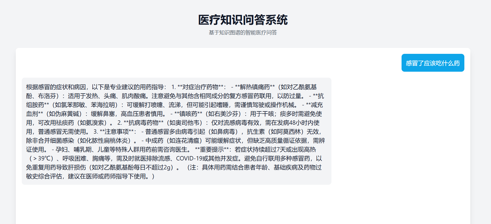

# GraphRAG: 基于知识图谱的检索增强生成系统

基于 GraphRAG (Graph-based Retrieval Augmented Generation) 技术的智能医疗问答系统，将知识图谱的精确检索能力与生成式 AI 的语义理解能力相结合，为用户提供准确、及时的医疗咨询服务。

## 效果图



## 系统架构

### GraphRAG 技术架构
- 知识图谱检索层：基于 Neo4j 的高效图数据库检索
- 语义理解层：Deepseek API 的深度语义理解
- 知识融合层：检索结果与生成模型的智能融合
- 流式响应层：实时生成与展示

### 知识图谱规模
- 4.4 万医疗实体节点
- 30 万实体关系边
- 支持多种实体类型：疾病、症状、药品、检查项目等
- 支持多种关系类型：症状、病因、治疗、检查等

## 技术特点

- 🔄 GraphRAG 架构：结合图数据库检索和生成式 AI
- 🎯 精准检索：基于图数据库的高效知识检索
- 🤖 智能生成：基于检索结果的上下文感知生成
- ⚡ 实时响应：流式输出，即时反馈
- 🔄 离线支持：知识图谱不可用时仍可提供服务
- 🛡️ 安全可靠：完善的错误处理机制

## 技术栈

### 后端
- Python 3.8+
- Flask：Web 框架
- Neo4j：图数据库
- Deepseek API：生成模型
- python-dotenv：环境变量管理

### 前端
- React：UI 框架
- Tailwind CSS：样式框架
- Axios：HTTP 客户端

## 快速开始

### 1. 环境要求
- Python 3.8+
- Node.js 14+
- Neo4j 数据库
- Deepseek API 密钥

### 2. 安装步骤

1. 克隆仓库
```bash
git clone https://github.com/LLTzz/GraphRAG.git
cd GraphRAG
```

2. 后端设置
```bash
# 创建虚拟环境
python -m venv venv
source venv/bin/activate  # Linux/Mac
venv\Scripts\activate     # Windows

# 安装依赖
pip install -r requirements.txt

# 配置环境变量
cp .env.example .env
# 编辑 .env 文件，填入你的配置
```

3. 前端设置
```bash
cd frontend
npm install
```

### 3. 运行系统

1. 启动 Neo4j 数据库

2. 启动后端服务
```bash
python graph_qa_system.py
```

3. 启动前端服务
```bash
cd frontend
npm start
```

4. 访问系统
打开浏览器访问 http://localhost:3000

## 项目结构

```
graphrag-system/
├── frontend/                # React前端
│   ├── src/
│   │   ├── components/     # React组件
│   │   ├── App.js         # 主应用组件
│   │   └── index.js       # 入口文件
│   └── public/            # 静态资源
├── graphrag_qa_system.py     # GraphRAG后端主程序
├── graph_qa_system.py   # 生成模型接口
├── requirements.txt       # Python依赖
└── README.md             # 项目文档
```

## GraphRAG 工作流程

1. 用户输入问题
2. 系统解析问题意图
3. 从知识图谱中检索相关信息
4. 将检索结果作为上下文提供给生成模型
5. 生成模型结合上下文生成答案
6. 流式返回生成的答案

## 问答示例

系统支持多种类型的医疗问题，例如：

- 疾病症状查询：`乳腺癌的症状有哪些？`
- 病因分析：`为什么有的人会失眠？`
- 治疗方案：`高血压要怎么治？`
- 用药指导：`肝病要吃啥药？`
- 检查项目：`脑膜炎怎么才能查出来？`

每个问题都会得到基于知识图谱的专业回答，并通过流式响应实时展示。

## 使用指南

1. 系统支持以下类型的医疗问题：
   - 疾病症状查询
   - 病因分析
   - 治疗方案建议
   - 用药指导
   - 检查项目说明

2. 使用建议：
   - 使用清晰、具体的描述
   - 一次只问一个问题
   - 对于紧急情况，请立即就医

## 开发计划

- [ ] 优化 GraphRAG 检索算法
- [ ] 增加知识图谱规模
- [ ] 改进生成模型提示工程
- [ ] 添加多语言支持
- [ ] 实现知识图谱可视化
- [ ] 添加用户反馈机制

## 贡献指南

1. Fork 项目
2. 创建特性分支 (`git checkout -b feature/AmazingFeature`)
3. 提交更改 (`git commit -m 'Add some AmazingFeature'`)
4. 推送到分支 (`git push origin feature/AmazingFeature`)
5. 开启 Pull Request

## 许可证

本项目采用 MIT 许可证 - 详见 [LICENSE](LICENSE) 文件

## 联系方式

- 项目维护者：[liutongzhao]
- 邮箱：[liutongzhao1@gmail.com]
- GitHub：[https://github.com/LLTzz]


